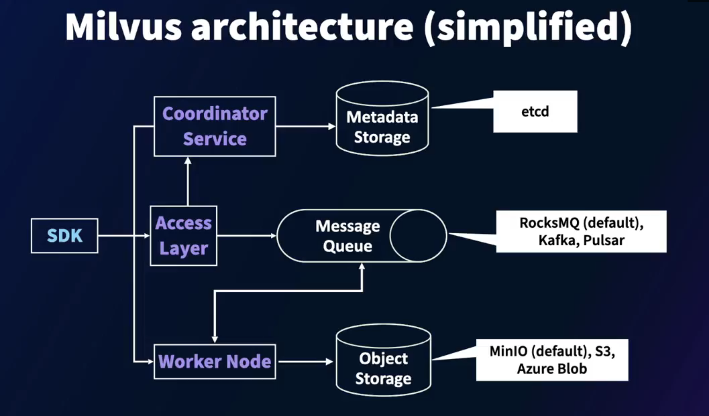
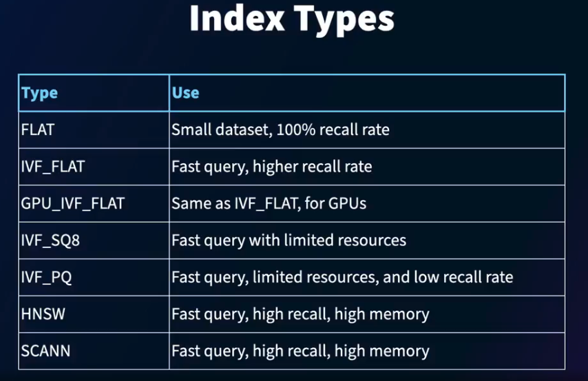

#### Introduction to Milvus DB

- What is Milvus
Milvus is a specialized database that is built for storing, indexing, and searching vectors.

- Milvus DB Features
  - Open source and commercial
  - Standalone, cluster, and managed (Zilliz Cloud) options
  - Highly scalable for vector storage and search
  - Euclidean distance(L2), inner product(IP) and COSINE metrics
  - Hybrid data storge and search
  - Access with SDKs(Python, Node.js, Go, Java)

#### Milvus Architecture

- Milvus architecture(simplified)

link : [Milvus Architecture Overview](https://milvus.io/docs/architecture_overview.md)

#### Collections in Milvus

- Databases in Milvus
  - Each Milvus instance can manage mulitple databases (max: 64)
  - Default databases is "default"
  - A database is a container for data
  - RBAC implemented by database
  - Multitenancy option

- Collections in Milvus
  - A Milvus collection is like a table in traditional databases
  - Has schema that defines fields for data storage
  - Fields have datatypes, size, default values
  - Scalar and vector fields
  - Primary keys and auto-generated keys are available
  - Dynamic fields allow ad hoc fields to be added

- Scalar datatypes
  - INT8
  - INT16
  - INT32
  - INT64
  - FLOAT
  - DOUBLE
  - VARCHAR
  - BOOL
  - JSON
  - ARRAY
  
- Vector datatypes
  - BINARY_VECTOR
  - FLOAT_VECTOR

#### Partitions in Milvus

- Partitions in Milvus
  - Each collection can be split up as multiple partitions
  - Data in the same partition is stored physically together
  - Default partition is _default
  - Data can be inserted to and queried from partitions specially
  - Partition keys can be used for automatic allocation
  - Partitions help optimize storage and search operations

#### Indexes in Milvus

- Indexes in Milvus
  - Indexes help speed up search operations
  - Create on scalar or vector fields
  - One index only per field
  - Orangizes vectors based on the approximate nearest neighbor (ANN) metric type chosen
  - Prerequisite for doiung ANN searches

- Index Types

#### Managing Data in Milvus

- Managing Data
  - Rows are also called entities in Milvus
  - Bulk inserts possible and recommended
  - Flush operation needed to index newly inserted data
  - Upsert available based on the primary key
  - Delete entites by primary key or Boolean expression

#### Query and Search with Milvus

- Query
  - Scalar-based filtering and retrieval process (like RDBMS)
  - Specify output fields, limits, and offsets
  - Restrict query to partitions
  - Count(*) available to aggregate data
  - Query features are limited compared to RDBMS systems

- Filter Capabilities
  - Comparsion operators( ==, !=, >, <, >=, <=, IN)
  - Logical operators( &&, ||)
  - Match operators(like)
  - Array operators(ARRAY_CONTAINS)
  - JSON operators(JSON_CONTAINS)
  - Refer : https://milvus.io/docs/boolean.md

- Search
  - Search on any vector field using a search query
  - Search query should be converted to vector (same model)
  - Metric used should be the same as the index metric (like L2, IP)
  - Specify limit and offset
  - Radius can be used to filter based on similarity (distance)
  - Returns distance to the original query in addition to results

#### Set up Milvus and exercise files