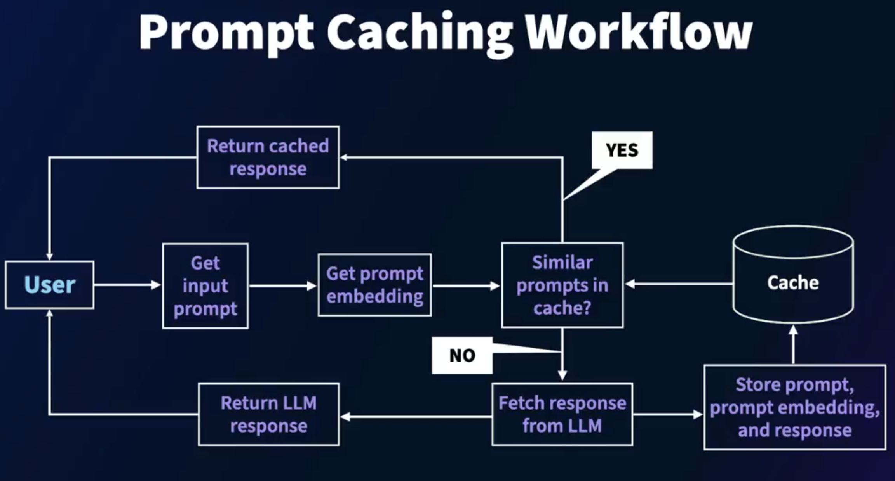

# Vector DB for LLM Query Caching

#### LLMs and Caching

- Shortcommings with Using LLMs
  - Large language models (LLMs) have revolutionized the use of AI
  - Severl apps are being built with LLMs in the back end
  - LLMs are expensive to build, deploy, maintain, and use
  - Cost per inference call is high
  - Latency per inference is also high, given the nature of LLMs

- Cachiing
  - In a given organization or context, users trigger similar prompts to the LLM, resulting in the same responses
  - Caching prompts and responses and serving similar prompts from the cache helps reduce cost and latency
  - Prompt/response caching is becoming an essential component of generative AI applications

#### Prompt caching workflow

- Prompt Caching Workflow

