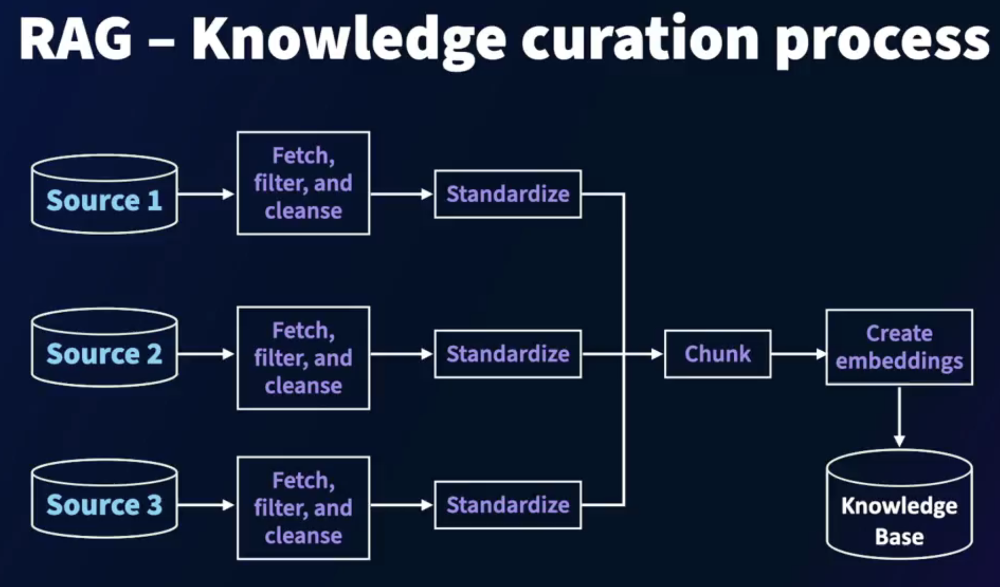
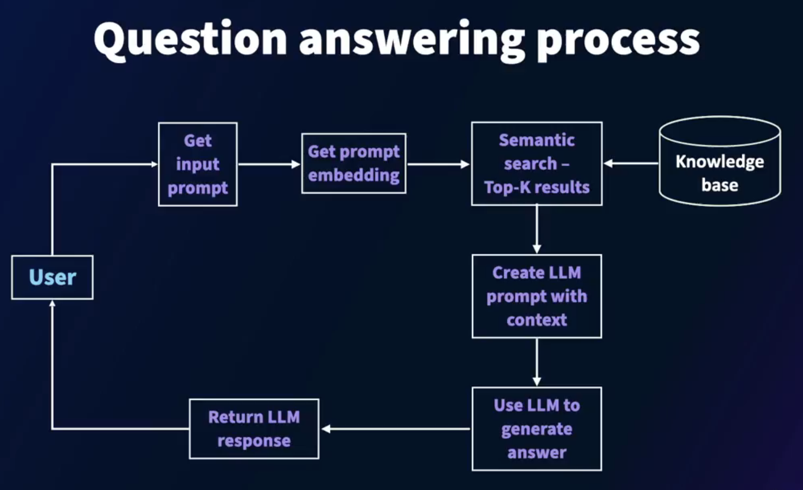

# **Introduction to Retrieval Augmented Generation (RAG)**

#### **LLMs as a knowledge source**

- LLM Capabilties
  - Language capabilites
    - Understanding, reasoning, generating, and traslating text
  - Knowledge capabilites
    - Question answering, knowledge distillation

- LLM as a Knowledge Base : Shortcomings
  -  Can only answer question based on the data they are trained on
  -  Answer may not be current
  -  LLMs can hallucinate
  -  Cannot answer based on enterprise/confidential data
  -  Building custom LLMs/fine-tuning with organizational

#### **Retrieval Augmented Generation (RAG)**

Retrieval augmented generation (RAG) is a    
framework that combines knowledge from a   
curated knowledge base with the generation    
capabilities of an LLM to provide accurate   
and well-structed answers.     

- RAG Features
  - Use enterprise and confidential data sources
  - Combine data from multiple data sources in different formats
  - Curate/prune data to ensure up-to-date and accurate knowledge
  - Use semantic and hybrid search to find answers to queries
  - Use standard/out-of-the-box LLMs to reduce cost

#### **RAG: Knowledge curation process**

- RAG-Knowledge curation process

#### **RAG: Question answering process**

- Question answering process

#### **Applications of RAG**

- Popular RAG Applications
  - Interactive chatbots
  - Automated email responses for customer queries
  - Root cause analysis (based on observations and manuals)
  - Ecommerce search
  - Automated help desk (HR, legal, logistics)
  - Document hub searches
